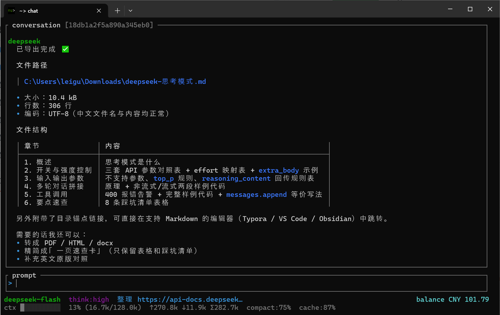

# nu_plugin_ds



A [nushell](https://www.nushell.sh) plugin for talking to the [DeepSeek](https://platform.deepseek.com)
API from your shell.

```nu
> chat                      # full-screen chat client
> cc "列出当前目录所有文件"     # natural language -> nushell command, with confirmation
> ds models                 # which models can this key use?
```

* **`chat`** — a full-screen transcript with a status bar showing the model, the thinking
  level, the session, the estimated context usage and the tokens spent. Models are
  fetched from the API and can be switched at any time; the history is compacted
  automatically when it grows too large; every conversation is saved and can be reopened.
* **`cc`** — turns a request in plain language into a nushell command, shows it, and runs
  it once you confirm.
* **`ds models`**, **`ds sessions`**, **`ds config`**, **`ds change-api-key`** — inspect the
  models, the stored conversations and the resolved configuration, and manage the API key.

> **Unofficial project.** This plugin is not affiliated with, endorsed by or sponsored by
> DeepSeek. See the [disclaimer](#disclaimer).

## Install

```nu
cargo build --release
plugin add target/release/nu_plugin_ds
plugin use ds
```

You need an API key. The plugin looks for it in this order and takes the first it
finds:

1. `--api-key` on the command line;
2. `$env.DEEPSEEK_API_KEY` in the nushell environment;
3. the operating system's credential store.

On first use, when none of those is set, the plugin asks you to paste the key and saves
it in the credential store:

```nu
> chat
No DeepSeek API key is configured. Create one at https://platform.deepseek.com/api_keys
Paste your DeepSeek API key:
  (input is hidden, Esc to cancel) ****
nu_plugin_ds: saved to Windows Credential Manager (change it later with `ds change-api-key`)
```

You can also set it up ahead of time, or keep using the environment variable if you
prefer:

```nu
> ds change-api-key                     # prompt for the key and store it
> ds change-api-key --api-key sk-...    # store it without prompting

$env.DEEPSEEK_API_KEY = "sk-..."        # override the stored key for one session
'$env.DEEPSEEK_API_KEY = "sk-..."' | save --append $nu.env-path
```

## chat

```nu
chat                                              # continue the most recent conversation
chat --new                                        # start a fresh one
chat --new --model deepseek-v4-pro --think high    # pick the model and reasoning level
chat --session planning                            # reopen a conversation by title or id
chat --prompt "explain this stack trace"           # ask immediately
chat -p "hi" --return-session | get usage          # get the session record as well
```

Quitting the window returns nothing, so nushell does not draw a table over your prompt.
Use `--return-session` (or `ds sessions --show`) when you actually want the record. Without
a terminal, `chat --prompt` performs a single request and returns the answer as a plain
string, so `chat -p "hi" > answer.txt` and `chat -p "hi" | str upcase` both do the obvious
thing.

Answers are rendered as markdown: headings, bold and italic, inline code, fenced code
blocks, lists (including task lists), quotes, rules, links and tables are formatted rather
than shown with their markers. The renderer is streaming-safe, so half-typed markup is
shown literally until it closes. `/markdown` toggles it for the session.

The transcript border shows the conversation's session id and the working directory its
commands run in, both in brackets (e.g. `[ab12cd34] [/home/me/project]`), so it is always
clear which conversation is open and where `run_nu` will run.

### File tools and commands

The model can ask to use three tools:

* **`read_file`** — read a text file, so the model can see what is in it before changing it;
* **`write_file`** — create or replace a text file (missing parent directories are created);
* **`run_nu`** — run a nushell command and read its output.

Each call is classed by how much it can change, and only the risky classes are confirmed
first:

| Risk | Tool | Confirmed by default |
| --- | --- | --- |
| read | `read_file` | no — a read cannot change anything |
| write | `write_file` | yes |
| command | `run_nu` | yes |

When a call does need confirming it is shown first, led by a one-line risk warning (read,
write or command), then the resolved path (or the command) and a preview of what will
happen, and waits for a key:

| Key | Action |
| --- | --- |
| `Enter` | run this call |
| `Esc` | skip it (the model is told you declined) |
| `a` | allow every call of *this class* for the rest of the session |

| Flag | Meaning |
| --- | --- |
| `--allow-tools` | do not ask before any tool call (shorthand for the three below) |
| `--allow-reads` | do not ask before reading a file |
| `--allow-writes` | do not ask before writing a file |
| `--allow-commands` | do not ask before running a command |
| `--no-tools` | do not offer the tools at all |

`/tools` toggles them for the session. Four settings control the defaults:
`confirm_tool_reads` (`false`), `confirm_tool_writes` (`true`), `confirm_tool_commands`
(`true`) and `tool_command_timeout_secs` (`120`); `tools` (offer them at all) and
`max_tool_rounds` (how many rounds one turn may use before it stops) also apply.

**Reading a file sends its contents to DeepSeek.** The confirmation says so before you
approve it. Both current models (`deepseek-flash` and `deepseek-v4-pro`) support tool
calling. Tool calls and their results are stored in the session like any other message, so a
conversation that used a tool reopens with its full history.

#### `run_nu`

`run_nu` runs each command in a **fresh nushell process**, so `cd` and `$env` changes do not
persist between calls and no shell state is changed: chain the steps you need into one
command, or use absolute paths. Output (stdout, then stderr) is captured and truncated to
32 KiB per stream, and the command is killed after `tool_command_timeout_secs`. `run_nu` is
only offered when a `nu` executable can be found (via `nu_bin`, `$env.NU_PLUGIN_DS_NU_BIN`
or `$env.PATH`).

**The command is shown before it runs, and reading it is the only protection: there is no
denylist.**

### Keys

| Key | Action |
| --- | --- |
| `Enter` | send the prompt |
| `Shift+Enter`, `Ctrl+Enter` | insert a newline |
| `Esc` | cancel the answer, or clear the prompt |
| `Ctrl+C` | cancel the answer (when nothing is running it quits instead) |
| `Ctrl+X` | quit |
| `Ctrl+D` | quit when the prompt is empty; otherwise delete the character under the cursor |
| `Ctrl+O` | switch model (the list comes from `GET /models`) |
| `Ctrl+T` | switch thinking level (`off` / `low` / `high` / `max`) |
| `Ctrl+B` | browse sessions (see below) |
| `Ctrl+N` | start a new session |
| `Ctrl+R` | regenerate the last answer |
| `Ctrl+F` | search the transcript (see below) |
| `Ctrl+/` | the full help card |
| `Ctrl+L` | jump to the end of the transcript |
| `Ctrl+Home` / `Ctrl+End` | jump to the top / bottom of the transcript |
| `PgUp` / `PgDn`, `Alt+↑` / `Alt+↓` | scroll the transcript |
| mouse wheel | scroll the transcript a few lines up or down |
| left-button drag | select transcript text; the selection is copied to the clipboard when the button is released |
| `Up` / `Down` | move in the prompt; on the first line they browse the input history |
| `Left` / `Right`, `Home` / `End`, `Delete`, `Backspace` | move in or edit the prompt |
| `Ctrl+A` / `Ctrl+E` | jump to the start / end of the line |
| `Ctrl+U` / `Ctrl+K` / `Ctrl+W` | readline style editing (kill line, kill to end, delete word) |

Quitting — `Ctrl+X`, `Ctrl+C`, `Ctrl+D` on an empty prompt, or `/quit` — asks for
confirmation first: `Enter` or `y` quits, `Esc` or `n` stays. The session is saved either
way.

While a tool call is waiting to be confirmed the keys above are replaced by `Enter` (run
it), `Esc` (skip it) and `a` (allow this class of call for the rest of the session); that
table is under [File tools and commands](#file-tools-and-commands).

Session picker (`Ctrl+B`):

| Key | Action |
| --- | --- |
| `↑` / `↓`, `k` / `j` | move the selection |
| `n` | create a new session |
| `d`, `d` | delete the selected session (press `d` twice to confirm). Deleting the open conversation also closes it, and the picker stays open so another can be chosen |
| `Enter` | open the selected session |
| `Esc` | close the picker |

Search (`Ctrl+F`):

| Key | Action |
| --- | --- |
| `Ctrl+F` | open the search, or close it again |
| typing | filter the transcript live (case-insensitive substring) |
| `Enter` / `↓` | next match |
| `Shift+Enter` / `↑` | previous match |
| `Esc` | close the search and restore the prompt draft |

Matches are highlighted in the transcript, the current one in a stronger colour, and each
step scrolls it into view. The prompt title reads `n/total` while searching.

### Slash commands

`/help` · `/model [name]` · `/think [off|low|high|max]` · `/sessions` · `/new [name]` ·
`/rename <name>` · `/compact` · `/clear` · `/system [text]` · `/markdown` · `/tools` ·
`/regenerate` · `/models` · `/balance` · `/save` · `/quit`

### Status bar

The first line reports the current turn — a spinner while waiting or streaming, and
`running <tool> (Ns)` with its own spinner while a tool call runs — followed by the model,
the thinking level, a `tools:off` / `tools:auto` marker when it applies, the session title
and how many times the history was compacted. When the provider offers a balance endpoint,
the remaining credit sits at the right of this line, e.g. `balance CNY 110.00 (gift 10.00)`.

The second line reports the context budget: an estimated usage bar against the model's
context window (the estimate is local, since the plugin never sees a tokenizer), the
percentage and tokens in use, the session totals reported by the API (`↑` prompt, `↓`
completion, `Σ` total), the compaction ratio in force (`compact:75%`) and the prompt cache
hit rate (`cache:62%`). Short status messages — a compaction result, a warning — appear at
the right of this line; on a narrow terminal the low-priority key hint is dropped so the
gauge keeps its room.

## Context compaction

The context window belongs to the model, not to the plugin: the current DeepSeek models
(`deepseek-flash` and `deepseek-v4-pro`) expose a 1M token context, and the API refuses a
longer request. `context_limit` is the *local* budget that decides when history is
compressed; it defaults to the model's window, and `compact_ratio` is the fraction of it
that triggers compaction. Set `context_limit` only when the endpoint behind `base_url`
really serves a different window.

Once the estimate passes `context_limit * compact_ratio`:

1. the oldest messages are sent to the model in a separate request asking for a dense
   summary (this happens before the answer, and the status bar says `compacting context…`);
2. those messages are replaced by a single `system` message holding the summary;
3. the prompt, the most recent `keep_recent_messages` messages and the summary are kept.

Setting `context_limit` larger than the window the endpoint actually serves does not buy a
bigger one: it only means the API will refuse the request before the local budget is
reached. That is not fatal — when a request is refused as too long, the plugin compacts and
retries automatically (up to two times), and the summarising request is capped so it cannot
overflow in turn. If your endpoint really does serve a larger window, set `context_limit` to
that number and the plugin will use it as the budget.

The summary lives in the session, so reopening a conversation keeps its compressed history.
Token counts are estimates (Latin text is counted at roughly four characters per token, CJK
at about one token per character); only the compaction trigger and the gauge depend on them.

## cc

```nu
> cc "列出当前目录所有文件"
  ls ./
  ── deepseek-flash · think:off
  run this command? [Enter] yes  [Esc] no
```

| Flag | Meaning |
| --- | --- |
| `--no-execute` / `-n` | do not run anything; return the generated command as a string |
| `--shell` / `-s` | evaluate the generated command in this session instead of a new process; requires `--no-execute` and asks before evaluating |
| `--yes` / `-y` | with `--shell`, skip that confirmation (for scripts) |
| `--model` / `-m`, `--think` / `-t` | model and reasoning level for this request |
| `--nu` | path to the `nu` executable used to run the command |

`cc` is silent once it is done: the command writes its own output, and returning a value
would only draw a table over it. `--no-execute` is the inspection mode and returns the
generated command as a string:

```nu
cc --no-execute "disk usage of the largest 5 folders"      # prints the command
cc -n "count the lines in every .rs file" | str trim       # or pipe it
cc -n -s "go to the parent directory"                      # evaluated in this session, so cd sticks
```

The generated command is run by a **new** `nu --commands` process in the current directory.
That keeps it simple and safe, but it also means the command cannot change your shell's
state: `cd` and `$env` assignments do not survive the call. Run the command yourself with
`cc --no-execute` if you need that.

With `--no-execute --shell` the plugin never starts a process: a single plain command is
handed to the running session through the engine, so `cd` and `$env` changes actually take
effect. It shows the command and asks for confirmation first (pass `--yes` to skip that);
without a terminal it refuses to evaluate and returns the text instead. Only one plain command can be handed over this way (no pipelines, flags or `$`
expansions) because a plugin cannot parse new source; anything else is reported on stderr
and returned as text instead.

Without a terminal the command is never run; use `--no-execute` to get the command itself.
When a command exits non-zero, `cc` says so on stderr.

## ds models / ds sessions / ds config / ds change-api-key

```nu
> ds models                                  # [{id, owned_by, active}, ...]
> ds models | where active | get id

> ds sessions                                # [{id, title, model, updated_at, turns, messages}]
> ds sessions --new planning
> ds sessions --show planning | get messages | length
> ds sessions --delete planning
> ds sessions --dir                          # where conversations are stored
> ds sessions --show planning | get usage.total_tokens

> ds config                                  # resolved settings, file locations, key presence
> ds config thinking                         # read one setting, with the values it accepts
> ds config thinking high                    # change it (`settings.json` is rewritten)
> ds config temperature none                 # `none` clears an optional setting
> ds config model deepseek-v4-pro | get value
```

`ds config <key> [value]` reads or writes a single setting. Writing validates the value
first, so an invalid one is refused (not written) and the error names the accepted options
for a setting that only takes a fixed set (e.g. `thinking` is one of `off`, `low`, `high`,
`max`; the `confirm_tool_*` and `markdown`/`tools` switches take `true`/`false`). Reading a
single setting returns `{key, value, options?, help}` — `options` is present only for a
fixed-set setting. Run `ds config` with no argument for the whole resolved configuration.

### Where the API key lives

The key is kept in the operating system's credential store — the Windows Credential
Manager (a DPAPI-protected vault), the macOS Keychain, or the Linux Secret Service — and
is **never written to `settings.json`** or any other plaintext file. `ds config` reports
where it came from (`api_key_source`) and which store holds it (`api_key_store`), but only
ever prints a masked version of the key itself.

```nu
> ds change-api-key                          # ask for the key and store it
Paste your DeepSeek API key:
  (input is hidden, Esc to cancel) ****
> ds change-api-key --api-key sk-...         # store it without prompting
> ds change-api-key --no-verify              # skip the `GET /models` check
> ds change-api-key --delete                 # remove it again
> ds config | select api_key_source api_key_store api_key_account
```

| Flag | Meaning |
| --- | --- |
| `--api-key <key>` | store this key instead of prompting (it will be visible in your shell history) |
| `--delete` / `-d` | remove the stored key |
| `--no-verify` | do not check the new key against the API |
| `--base-url <url>` | API root used for the check |

Unless `--no-verify` is passed, a newly entered key is checked with `GET /models`; a
failed check is reported but the key stays stored. Removing a key that is not there is
not an error. You can also find and remove the entry in the system's own credential UI
(it is stored under the service `nu_plugin_ds`, account `deepseek-api-key`).

On a machine with no usable credential store, fall back to the environment variable
`DEEPSEEK_API_KEY`; that always takes precedence over the store. Set
`$env.NU_PLUGIN_DS_KEYRING_ACCOUNT` to keep several keys apart (it overrides the account
name; the test suite uses it so it never touches your real entry).

## Settings

Settings live in `settings.json` in the plugin's config directory
(`%APPDATA%\nu_plugin_ds` on Windows, `~/.config/nu_plugin_ds` on Linux,
`~/Library/Application Support/nu_plugin_ds` on macOS). Set
`$env.NU_PLUGIN_DS_CONFIG_DIR` to keep a project's conversations next to the project.

```json
{
  "base_url": "https://api.deepseek.com",
  "model": "deepseek-flash",
  "thinking": "off",
  "temperature": null,
  "max_tokens": null,
  "context_limit": null,
  "compact_ratio": 0.75,
  "keep_recent_messages": 8,
  "system_prompt": null,
  "nu_bin": null,
  "markdown": true,
  "tools": true,
  "confirm_tool_reads": false,
  "confirm_tool_writes": true,
  "confirm_tool_commands": true,
  "tool_command_timeout_secs": 120,
  "max_tool_rounds": 8
}
```

| Setting | Meaning |
| --- | --- |
| `base_url` | API root, without `/v1`. `$env.DEEPSEEK_BASE_URL` overrides it. |
| `model` | model used when a session does not pin one |
| `thinking` | `off`, `low`, `high` or `max` (`minimal`, `medium`, `xhigh` and `ultra` are accepted aliases) |
| `temperature`, `max_tokens` | passed to the API; temperature is ignored while thinking is on |
| `context_limit` | local token budget that triggers compaction; `null` (the default) uses the model's window (1M) |
| `compact_ratio` | fraction of the effective context limit that triggers compaction |
| `keep_recent_messages` | messages always kept verbatim when compacting |
| `markdown` | render answers as markdown (`true` by default) |
| `tools` | offer the file and command tools to the model (`true` by default) |
| `confirm_tool_reads` | show and confirm each read before it runs (`false` by default) |
| `confirm_tool_writes` | show and confirm each write before it runs (`true` by default) |
| `confirm_tool_commands` | show and confirm each command before it runs (`true` by default) |
| `tool_command_timeout_secs` | kill a `run_nu` command after this many seconds (`120` by default) |
| `max_tool_rounds` | how many tool rounds one turn may use (`8` by default) |
| `system_prompt` | system prompt used for new sessions (editable per session with `/system`) |
| `nu_bin` | `nu` executable used by `cc`; `$env.NU_PLUGIN_DS_NU_BIN` overrides it |

Environment variables: `DEEPSEEK_API_KEY` (optional if a key is stored),
`DEEPSEEK_BASE_URL`, `NU_PLUGIN_DS_CONFIG_DIR`, `NU_PLUGIN_DS_NU_BIN`,
`NU_PLUGIN_DS_KEYRING_ACCOUNT`. Every command also accepts `--api-key`, `--base-url`,
`--model` and `--context-limit` when you need to override things once.

## Notes and limitations

* **The chat client needs a real terminal.** It takes over the screen, so it cannot run when
  the plugin's stdin/stdout are used for the plugin protocol. Nushell normally upgrades a
  plugin to a local socket automatically — re-run `plugin add --force <binary>` if `chat`
  reports that it cannot take over the terminal. Without a terminal, `chat --prompt` still
  works as a single request.
* **Thinking mode is on by default in the current models.** `thinking: off` is sent as an
  explicit `{"thinking": {"type": "disabled"}}` switch, because the API's own default is
  on; `low`, `high` and `max` are sent as `reasoning_effort`. While thinking is on the
  API ignores `temperature`, so it only takes effect with thinking off. The thinking from
  earlier turns is echoed back to the API, which requires it once the request carries
  tools.
* **`cc` runs the generated command in a subprocess**, so it cannot mutate your shell state
  (see above). The model writes the command; read it before pressing Enter.
* **The API key is read from `--api-key`, then `$env.DEEPSEEK_API_KEY`, then the OS
  credential store.** It is never written to disk in plaintext, and `ds config` only ever
  prints a masked version. Use `ds change-api-key` to store or remove it.
* Conversations are plain JSON files under `<config>/sessions/`; they are written through a
  temporary file and renamed, so an interrupted write cannot lose one.

## Disclaimer

This is an **unofficial**, community project. It is not affiliated with, authorised,
endorsed or sponsored by DeepSeek, and it is not an official DeepSeek product. "DeepSeek"
and any related names and logos are trademarks of their respective owners; they are used
here only to say which API the plugin talks to.

The plugin is provided **"as is"**, without warranty of any kind. You are responsible for
your API usage and for the commands the model asks to run — always read a tool call before
you approve it.

## Development

```nu
cargo test                                    # unit tests + API tests against a mock server
cargo test --test e2e -- --ignored            # end-to-end tests that drive real nushell
```

`tests/support/` contains a small HTTP server used by the tests. It can answer in order or
by path, delivers streaming responses in chunks, and records every request, so the client's
request shaping, the server-sent-event parser, mid-stream disconnects and API error mapping
are all covered without touching the network. The `e2e` tests spin up that server, run
`nu --plugins <binary>` with an isolated plugin registry and config directory, and assert on
what the commands produce.

The TUI is covered by rendering tests: they draw frames into a `ratatui` `TestBackend` at a
range of terminal sizes and assert on the visible text.
